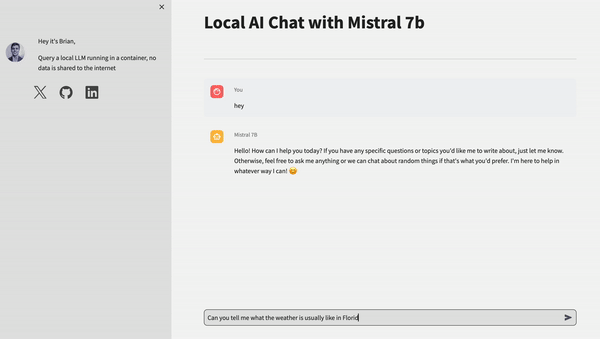

# Local AI Chatbot

Interact with an AI, like chatGPT, but without connecting to the internet. This code is my implementation of the Mistral 7b LLM with a user interface written in python. This repository acts as a user interface and example implemtation of running an AI model using Ollama, a framework that allows multiple langage models to be easily run and served to a local network for your own purposes, such as enterprise resource planning, or enterprise software. This approach is well suited for enterprise resource management due to its offline nature.


## How it works
A large language model is a type of probabalistic computer model that sequentially predicts the liklihood of the next word in a sequence of words, run locally without internet access. This type of model is good at recreating human like communication when trained on large textual datasets. The LLM is served to the local computer network on port 11434 running in a docker container, which can be easily shut off and deleted, or recreated using docker. Then, the user interface runs from a python program and is served on localhost:8501, accessible from the web browser. The model implemented here is not as quick or as smart as GPT-4.

## Use cases

The model uses here is easily swappable for any model supported by Ollama, and due to its ability to run locally, is well suited for enterprise software and enterprise resource planning, given its offline nature and higher security level, keeping company data offline.

&nbsp;



## Dependencies

This code uses the following libraries:
1. Python libraries
- `streamlit`: for building the user interface.
- `ollama`: for interacting with the local chatbot server
2. Docker
- Ollama Docker image
3. Mistral 7B model
- automatically downloaded by the ollama image, note that it is > 8GB

&nbsp;

## Usage

1. Build or pull the ollama image (the blueprint to run our container)
```
docker build -t ollama .
```
*or*
```
docker pull ollama/ollama
```

2. Run the docker image, specifying the network port you want to use 
```
docker run -d -v ./models:/root/.ollama -p 11434:11434 --name ollama ollama/ollama 
```

Now you can run the pythonic streamlit app to interact with the model, or use the terminal interface by continuing with step 5

3. Install the python dependencies

4. Run the app
```
Streamlit run app.py
```

5. Use the ollama client to query the LLM using docker exec. Use -it for interactive terminal
```
docker exec -it ollama ollama run model
```

6. Close the docker container
```
docker stop ollama
```

This will start the local Streamlit server, and you can access the chatbot by opening a web browser and navigating to `http://localhost:8501`.

&nbsp;

## Topics 
```
Python | Git | Low Code UI
textual data | natural language processing | AI | Chatbot | Mistral 7B 
Coding for learning purposes | Mechanical engineer | Robotics engineer 
```
&nbsp;

<hr>

&nbsp;

<div align="center">


╭━━╮╭━━━┳━━┳━━━┳━╮╱╭╮        ╭╮╱╱╭━━━┳━━━┳╮╭━┳━━━╮
┃╭╮┃┃╭━╮┣┫┣┫╭━╮┃┃╰╮┃┃        ┃┃╱╱┃╭━━┫╭━╮┃┃┃╭┫╭━╮┃
┃╰╯╰┫╰━╯┃┃┃┃┃╱┃┃╭╮╰╯┃        ┃┃╱╱┃╰━━┫╰━━┫╰╯╯┃┃╱┃┃
┃╭━╮┃╭╮╭╯┃┃┃╰━╯┃┃╰╮┃┃        ┃┃╱╭┫╭━━┻━━╮┃╭╮┃┃┃╱┃┃
┃╰━╯┃┃┃╰┳┫┣┫╭━╮┃┃╱┃┃┃        ┃╰━╯┃╰━━┫╰━╯┃┃┃╰┫╰━╯┃
╰━━━┻╯╰━┻━━┻╯╱╰┻╯╱╰━╯        ╰━━━┻━━━┻━━━┻╯╰━┻━━━╯
  


&nbsp;


<a href="https://twitter.com/BrianJosephLeko"></a> &nbsp; &nbsp; &nbsp; &nbsp; &nbsp; &nbsp; <a href="https://github.com/BrianLesko"></a> &nbsp; &nbsp; &nbsp; &nbsp; &nbsp; &nbsp; <a href="https://www.linkedin.com/in/brianlesko/"></a>

follow all of these or i will kick you

</div>


&nbsp;


